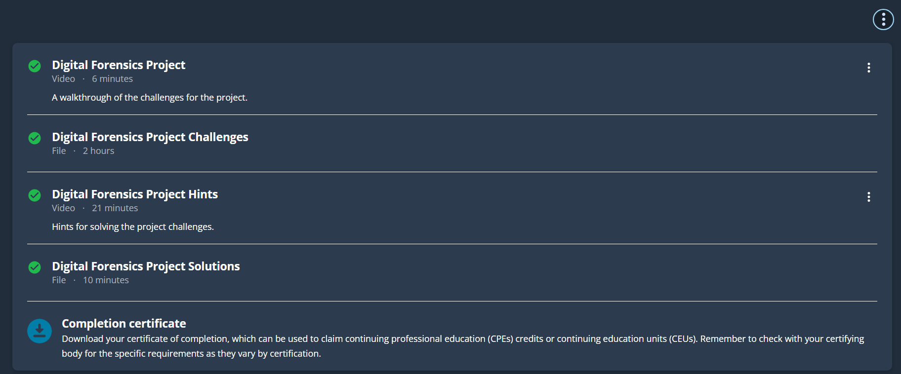

# 🕵️‍♂️ Digital Forensics Project – ISACA

This repository contains notes, workflows, real-case simulations, and visualizations related to the **Digital Forensics Project** course offered by **ISACA**. It serves as a reference toolkit for incident responders, forensic analysts, and cybersecurity researchers.

---

## 📚 Notes

All theory and methodology notes are located in the [`notes/`](./notes) directory:

- 📄 [`evidence-collection.md`](./notes/evidence-collection.md) – Best practices for acquiring digital evidence
- 📄 [`chain-of-custody.md`](./notes/chain-of-custody.md) – Maintaining integrity and legal admissibility
- 📄 [`digital-artifacts.md`](./notes/digital-artifacts.md) – Common digital traces: memory, logs, devices
- 📄 [`forensic-tools.md`](./notes/forensic-tools.md) – Tools for imaging, analysis, and extraction

---

## 🧪 Workflows

Find guided procedures and case-based investigations in [`workflows/`](./workflows):

- 🧾 [`cloud-account-investigation.md`](./workflows/cloud-account-investigation.md) – Analyze AWS IAM compromise
- 🧾 [`log-correlation-analysis.md`](./workflows/log-correlation-analysis.md) – Centralized log inspection for lateral movement

---

## 💼 Demos

Real-world analysis walkthroughs in [`demo/`](./demo):

- 📬 [`email-header-analysis.md`](./demo/email-header-analysis.md) – Trace spoofed email origins via headers
- 💾 [`usb-drive-analysis.md`](./demo/usb-drive-analysis.md) – Extract evidence from a seized USB device

---

## ☁️ Visual Playbooks

Visual and modern forensic strategies under [`visual/`](./visual):

- 🔍 [`cloud-forensics-process.md`](./visual/cloud-forensics-process.md) – Workflow for incidents in cloud environments

---

## 🖼️ Screenshots

| Section                  | Image |
|--------------------------|-------|
| 📘 Course Overview        |  |

---

## 🏅 Certificate

🎓 [`Digital Forensics Project.pdf`](./cert/Digital%20Forensics%20Project.pdf)

---

## 📝 Project Summary

This project simulates a **professional forensic engagement** with a focus on chain-of-custody, artifact correlation, and cloud-era incident analysis.

✅ **Key Learnings**:

- Proper evidence collection and documentation
- Analyzing memory devices and log trails
- Email forensics and spoof detection
- Working in hybrid (cloud + local) environments

---

## ✍️ Author

**Thành Danh** – Pentester & Cybersecurity Research

GitHub: [@ngvtdanhh](https://github.com/ngvtdanhh)  

Email: ngvu.thdanh@gmail.com

---

## 📄 License

This project is licensed under the **MIT License**.  
See [`LICENSE`](./LICENSE) for details.

© 2025 ngvtdanhh. All rights reserved.
